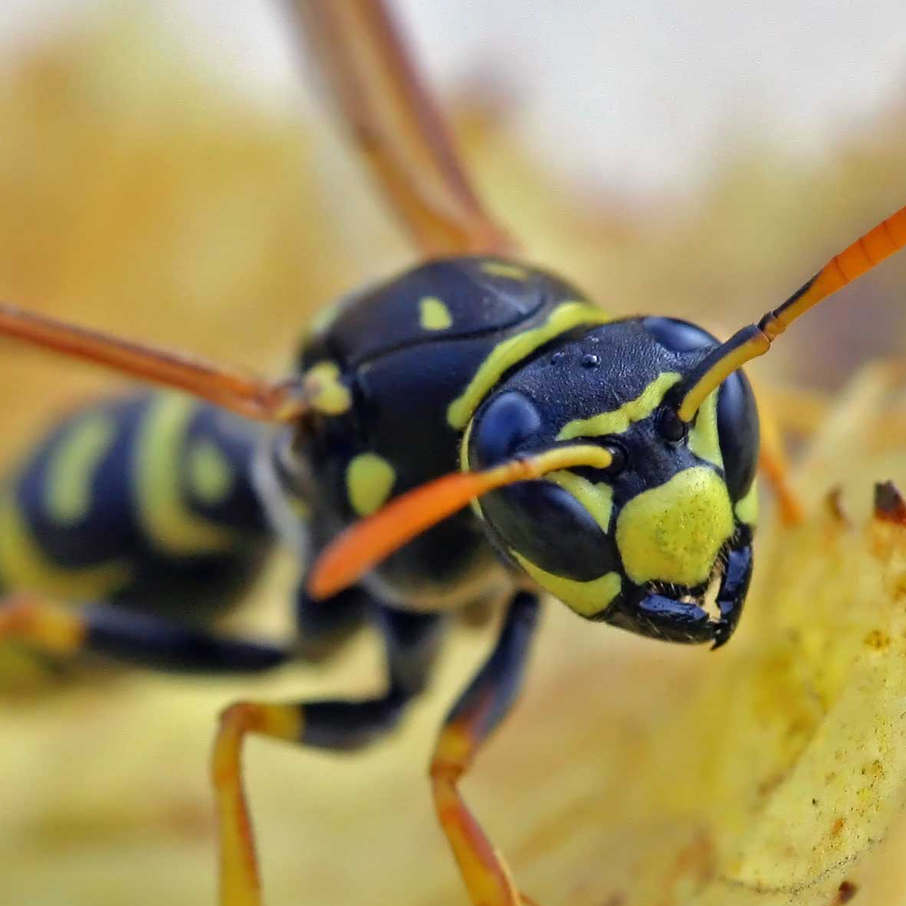

   
  
Image credit: <a href="http://commons.wikimedia.org/wiki/File:Polistes_dominulus_(%3Dgallicus)_-_head_(2005-10).jpg">Wikimedia Commons</a>

This page is the official distribution point for data, code, and documentation for the *Polistes dominula* genome project.
This project is a collaboration between the [Insect Sociogenomics Lab][tothlab] at Iowa State University (headed by Amy Toth) and the [Computational Genome Science Lab][brendelgroup] at Indiana University (headed by Volker Brendel).

## Links

- [supporting data](/data)
- [analysis code and documentation](/code)
- [genome browser](http://goblinx.soic.indiana.edu/PdomGDB)
- [HymHub][hymhub]

## Reference

**Standage DS, Berens AJ, Glastad KM, Severin AJ, Brendel VP, Toth AL** (2016) Genome, transcriptome, and methylome sequencing of a primitively eusocial wasp reveal a greatly reduced DNA methylation system in a social insect. *Molecular Ecology*, **25**, 1769-1784, [doi:10.1111/mec.13578](http://dx.doi.org/10.1111/mec.13578).

[tothlab]: http://www.public.iastate.edu/~amytoth/Toth_lab/Home.html
[brendelgroup]: http://brendelgroup.org/
[hymhub]: http://brendelgroup.github.io/HymHub
